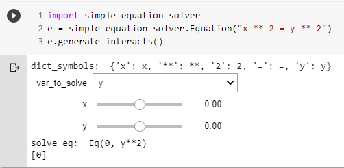

# simple-equation-solver

a packages to solve equations using python notebook base on sympy package

# installation
```
pip install pip install git+https://github.com/nilnil47/jupiter-simple-equsion-solver.git
```

# how to use
```python
import simple_equation_solver
e = simple_equation_solver.Equation("x ** 2 = y ** 2")
e.generate_interacts()
```

This will generate python-notebook interacts for each variable with range value between -1000 to 1000
and also a dropdown for choosing the variable to solve to

  

